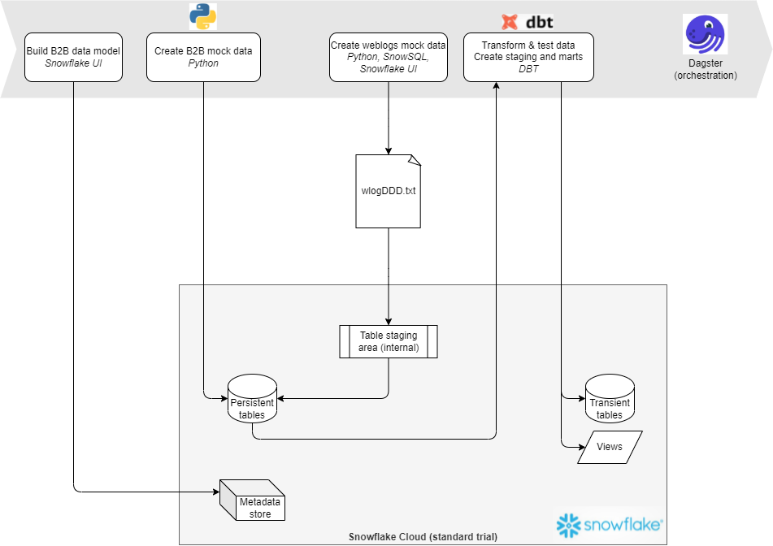
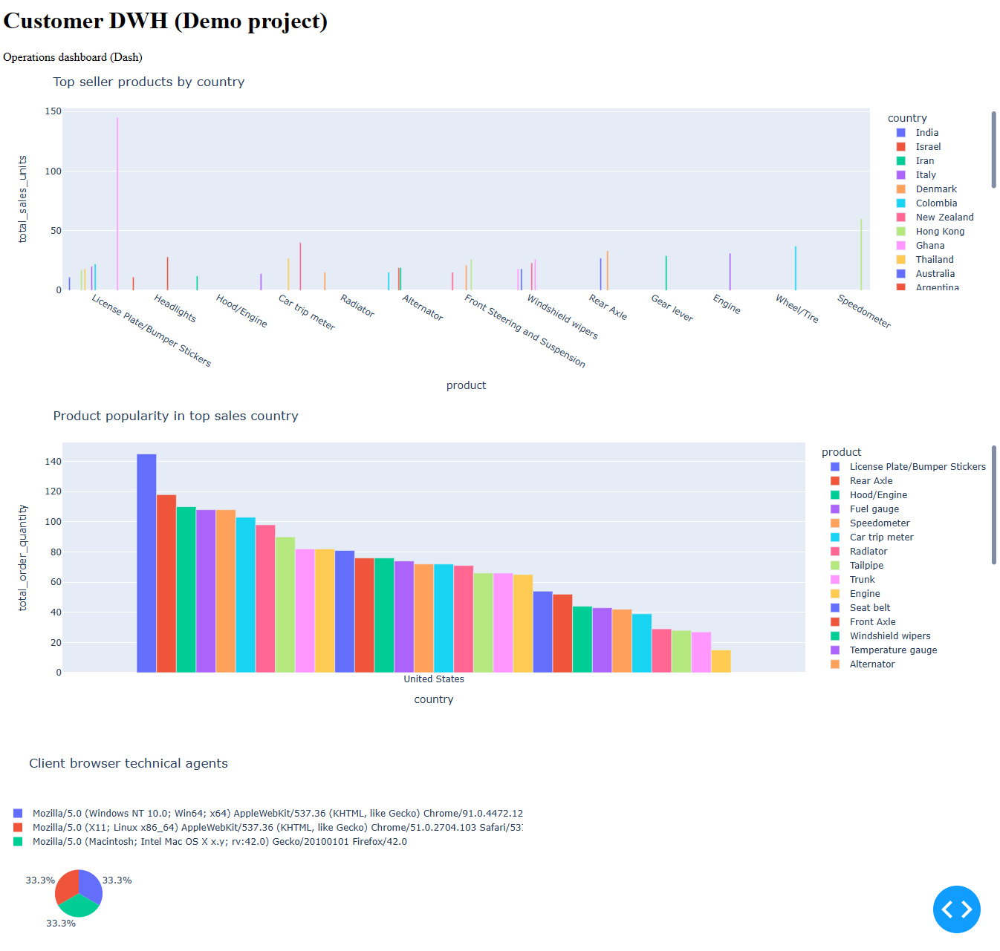
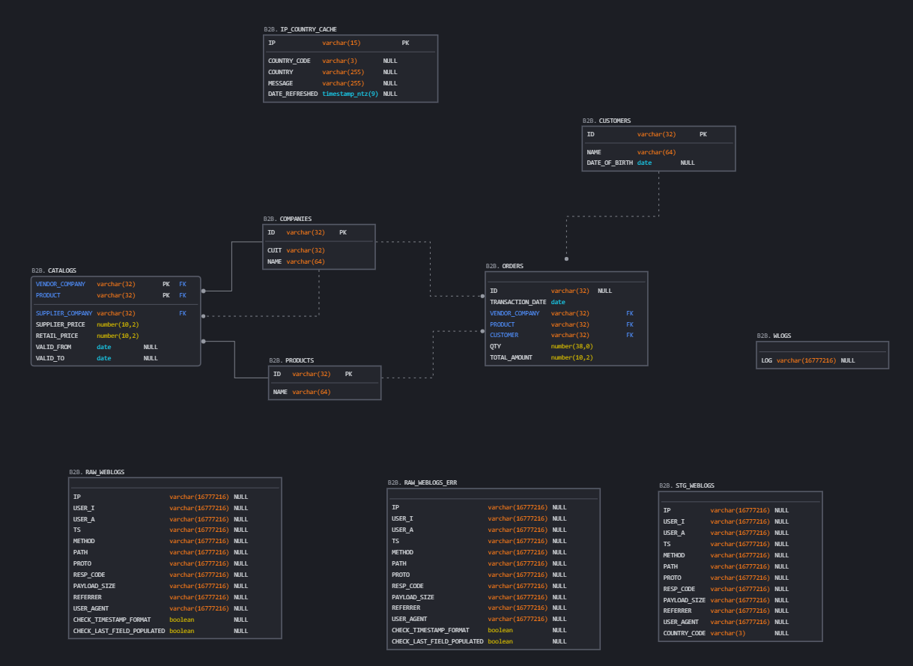
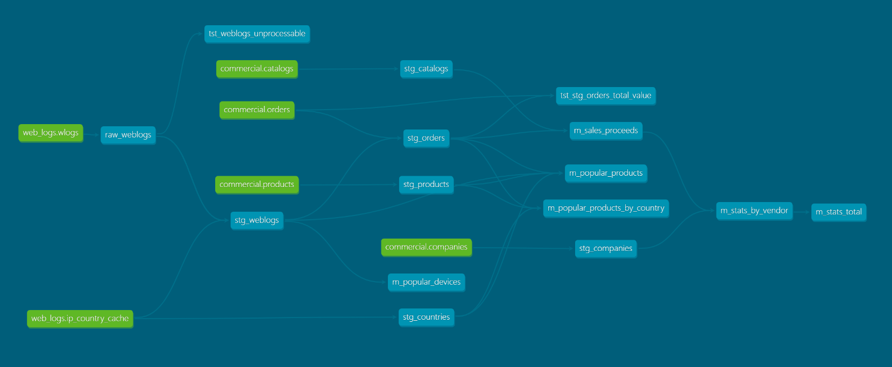

# Customer DWH sample project
Data engineering demo project implemented using Dagster (pipeline orchestration), Snowflake (cloud DWH persistency), DBT (data transformations), Python (generation of mock data; w/ adapters for Snowflake, SQLAlchemy etc) and Dash (BI).



This is how the dashboard looks like:



<br>

## Business design and assumptions
- reliance on **natural keys** for B2B entities. No surrogate keys are introduced.
- in order to **determine what country an order is shipped to**, an order is matched with the last record in the weblog that occured before the order and the country is considered to be the country to which the IP address was allocated at the time when the IP cache was last refreshed

    *potential future improvement points:*
    - *temporal behavior in the IP cache; build or use platform-provided mechanism; bi-temporal or tri-temporal model;*
    - *the order should not be dummily matched to the last web interaction before the order time, but it should be done based on the last call to a "place order" service;*

- **simplistic modeling of catalog** (SCD Type 1; no time-aware modeling; applicable to other entities as well)
    
    *potential improvement points:*
    - *model as SCD Type 2*

- **simplistic implementation of the catalog** (i.e. multiple prices across the supply chain are stored in a single entity in a denormalized structure which does not allow easy modeling or extensibility)

    *potential improvement points:*
    - *model transactions across the supply chain separately, assigning a correlation id related to the order when possible*

# Technical architecture

## ERD
ERD diagram is created by reverse engineering the DB schema.

To recreate:
- export the latest definition from Snowflake (`select get_ddl('schema','"CDWH"."CORE"', true)`)
- import the definition in [SQLDBM](https://app.sqldbm.com/Snowflake/BringDb/) or similar tool



<br>

## Documentation and lineage graph in DBT
> As a prerequisite, a DBT profile for the target DWH needs to be available in `~/.dbt/profiles.yml`.

```
cd PIPELINE/ops/dbt
dbt docs generate
dbt docs serve
```



<br>

# Run
Prerequisites:
- install required dependencies:
    ```
    pip install --editable .
    ```
- set environemnt variables:
    ```
    export SNOWSQL_USER=<>
    export SNOWSQL_PWD=<>
    export SNOWSQL_ACCT="<>"
    export DAGSTER_HOME="<>"
    ```

Run either:
- via Dagster UI (configuration for runs needs to be pasted manually from `resources.yaml`):
    ```
    dagit
    ```
- via CLI:
    - main pipeline (create data model, populate with masterdata, transform in DBT):

        ```
        dagster job execute -f PIPELINE/jobs/main.py -c resources.yaml
        ```

    - secondary pipeline (refresh ip-to-country cache); required for the correct rendering of data marts

        ```
        dagster job execute -f PIPELINE/jobs/ip_to_countries.py
        ```

    - test pipeline

        ```
        dagster job execute -f PIPELINE/jobs/test.py -c resources.yaml
        ```

# Build
DAGSTER (workflow/pipeline orchestrator):
```
dagster new-project PIPELINE
```

DBT (data transformation):
```
mkdir dbt
dbt init
```